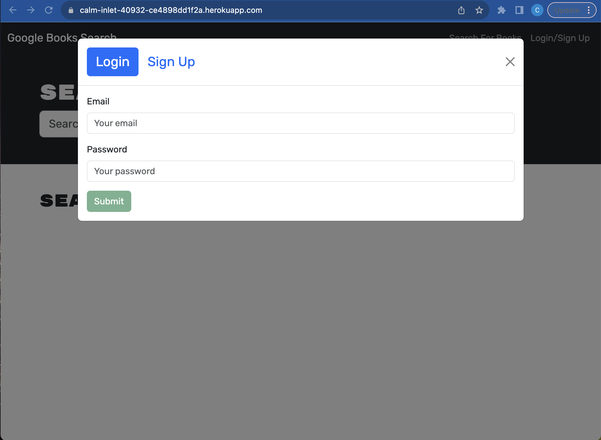
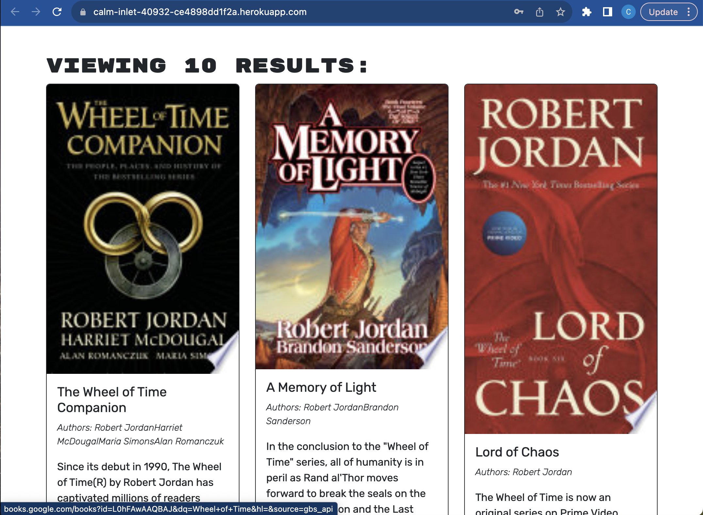
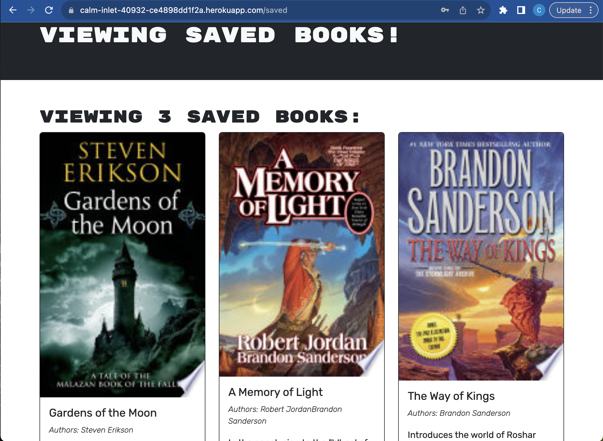

# Book Search Engine  
  ## Table of Contents:
  [Description](#description)
  [Installation Instructions](#installation-instructions)
  [Usage Information](#usage-information)
  [Screenshots](#screenshots)
  [Questions](#questions)

  ## Description:
  This project was built for a user to search for books using the Google Books API. A user can create an account, search for books, save any books they'd like to come back to, and remove those books from the saved list. The site provides the books title, author, a description, image, and link to purchase the book by clicking the book's image. The project uses React to build the user interface, MongoDB, and GraphQL and Apollo to query through persistent data.

  ## Installation Instructions
  To install the project locally, clone this repository and cd into the projects directory in the command line. Run npm install followed by npm run develop and the application will launch in your default browser on localhost.

  ## Usage Information
  To use the site, simply follow the instructions on the UI's Navbar, signup form, and login form.

  ## Screenshots
  
  
  

  ## Questions
  Please direct questions to [https://github.com/cslunsford](https://github.com/cslunsford) at [christopher.lunsford@uconn.edu](christopher.lunsford@uconn.edu).